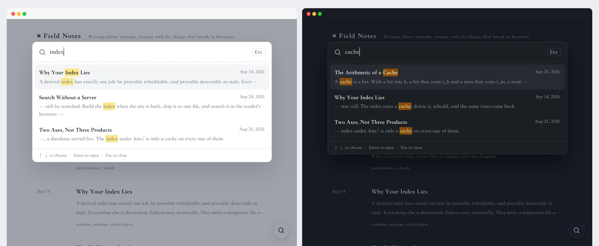

<p align="center">
  
</p>

<h1 align="center">站内搜索</h1>

<p align="center">
  让读者在浏览器里搜索你的 Kite 网站，不需要运行任何服务。
</p>

<p align="center">
  <a href="https://github.com/kite-plus/plugin-search/actions/workflows/ci.yml"></a>
  <a href="https://github.com/kite-plus/plugin-search/releases/latest"></a>
  <a href="https://github.com/kite-plus/kite"></a>
  
  <a href="LICENSE"></a>
</p>

<p align="center">
  <a href="README.md">English</a> · 简体中文
</p>

<p align="center">
  
</p>

站内搜索是 [Kite](https://github.com/kite-plus/kite) 的官方插件。索引在网站构建时生成，在读者的浏览器里搜索，所以网站能放在哪里，搜索就能用在哪里，GitHub Pages 也不例外。

## 特点

- **不需要运行任何东西**：没有搜索服务器，不用注册第三方服务，也不用保管密钥，只有一个随网站一起发布的索引文件。
- **随处都能打开**：每个页面角落的按钮、`/` 键、`Ctrl K`（Mac 上是 `⌘ K`），或者主题自带的搜索按钮。
- **中文也能搜**：关键词在标题、标签、正文里任意位置都能匹配，中文、日文不用分词也能找到。
- **和网站融为一体**：沿用页面的字体，跟随深浅色切换，结果里标出命中的词。
- **只收录读者读到的内容**：代码和标记不进索引；在文章的 front matter 里写 `search: false`，这篇文章就不会被搜到。
- **不搜不花流量**：索引在读者第一次打开搜索时才加载，平时浏览页面不会下载它。

## 安装

1. 从[最新版本](https://github.com/kite-plus/plugin-search/releases/latest)下载 `search-<版本>.zip`。
2. 在 Kite 后台打开「插件」，把 zip 拖到「上传插件」上，然后打开开关。

也可以在站点目录里用命令行：

```sh
kite plugin add search-0.1.0.zip
kite plugin enable search
```

需要 Kite 0.1 及以上版本。

## 设置

| 设置 | 默认 | 说明 |
|---|---|---|
| 搜索全文 | 开 | 收录每篇文章的全文。关闭后只搜索标题、标签和摘要，文章很多时索引更小 |
| 搜索按钮 | 开 | 在每个页面角落显示搜索按钮；主题自带搜索按钮时不显示 |

## 给主题作者

带有 `data-kite-search` 标记的元素都能打开搜索，同时角落的按钮会隐藏：

```html
<button type="button" data-kite-search>搜索</button>
```

## 工作原理

网站构建完成后，插件的模块 `plugin.wasm` 会拿到每个页面，写出 `plugins/search/index.json`：每篇文章和页面的地址、标题、日期、标签和正文，按时间从新到旧排列。读者第一次打开搜索时，`search.js` 加载这个索引，逐个匹配输入的关键词。模块运行在 Kite 的沙箱里：不能联网，也不能读写文件，只能处理交给它的页面。

## 开发

模块用 Go 编写，需要 Go 1.24 及以上版本编译成 WebAssembly。

```sh
make test     # 在本机测试索引逻辑
make build    # 生成 plugin.wasm
kite plugin verify .
```

想在站点里试用，运行 `kite plugin add /path/to/plugin-search`，会把这个目录连同模块一起复制进去。

## 发布新版本

修改 `plugin.yaml` 里的 `version` 并提交，然后推送同名的标签，例如 `v0.1.0`。发布工作流会测试并编译模块，打包不含源码的 `dist/search-<版本>.zip`，并附到 GitHub Release 上。在本地运行 `make zip` 可以打出同样的文件。

## 其他官方插件

| 插件 | 作用 |
|---|---|
| [访问统计](https://github.com/kite-plus/plugin-analytics) | 用百度统计、Google Analytics、Umami 或 Plausible 统计访问量 |
| [评论](https://github.com/kite-plus/plugin-comments) | 在每篇文章下放评论区，支持 Giscus、Waline 和 Twikoo |
| [公式与图表](https://github.com/kite-plus/plugin-math) | 用 KaTeX 排版 TeX 公式，把 mermaid 代码块画成图表 |

## 许可证

[Apache License 2.0](LICENSE)。
